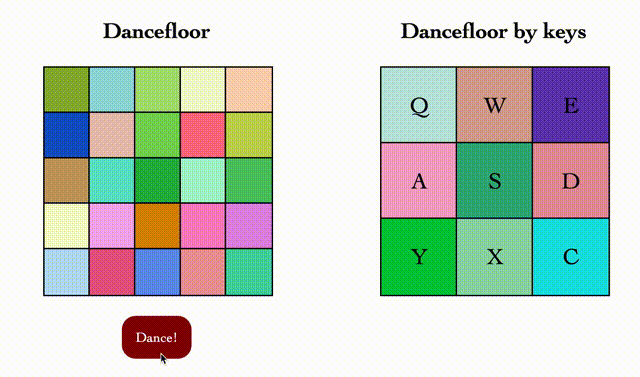

# Dancefloor

Welcome to the Dancefloor project! This React Single Page Application (SPA) offers two interactive features:

## Dynamic Dancefloor

On the left-hand side, you'll find a 5x5 grid representing a vibrant dancefloor. Simply press the "Dance!" button, and you'll see the cells changing colors periodically, creating a mesmerizing dancefloor experience.

## Interactive Key Grid

To the right, you'll find a 3x3 grid. Click on it and press a key on your keyboard. You'll see the cell corresponding to the key you pressed changes its color. This interactive feature adds a unique twist to the dancefloor, giving you the ability to control the colors using your keyboard inputs.

## Demo

